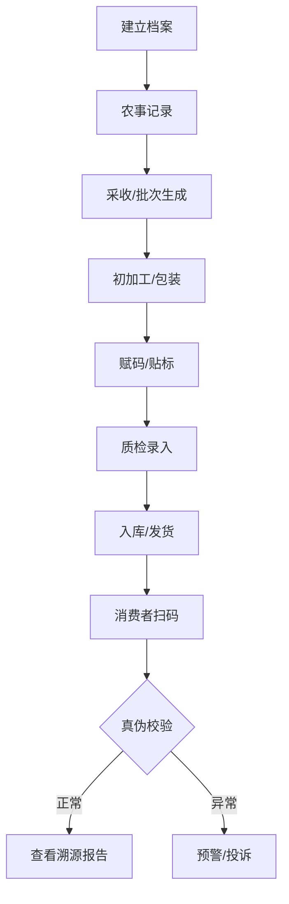

# 农产品全生命周期追溯系统需求文档 (PRD)

## 1. 修订记录
| 版本 | 日期 | 修订人 | 修订描述 |
| :--- | :--- | :--- | :--- |
| v1.0 | 2026-04-22 | 需求文档机器人 | 初始版本创建 |

## 2. 项目背景与目标
### 2.1 背景
随着消费者对食品安全意识的提升，农产品的透明度成为核心竞争力。政府监管部门也对农产品“一标一码”提出了更高要求。
### 2.2 目标
- 构建从田间到餐桌的全链路数字化记录体系。
- 提供真实、不可篡改的溯源凭证。
- 提升农产品品牌价值，增强消费者信任。

## 3. 用户角色定义
| 角色 | 描述 | 主要职责 |
| :--- | :--- | :--- |
| **种植户/农场主** | 生产一线的操作者 | 记录农事活动（施肥、喷药、灌溉、采收） |
| **加工商/包装厂** | 产品处理者 | 记录分拣、初加工、包装、赋码过程 |
| **质检员** | 质量把控者 | 上传抽检报告、第三方检测合格证 |
| **系统管理员** | 后台管控者 | 维护基础档案、生成追溯码、分配权限 |
| **消费者** | 最终受众 | 扫码查看溯源信息、进行评价或投诉 |

## 4. 核心功能需求

### 4.1 基础档案管理
- **地块管理**：管理农场、大棚、地块的地理位置、土壤肥力等。
- **作物品种库**：维护种子来源、生长周期、栽培技术要点。
- **人员/农资档案**：管理种植户信息及种子、肥料、农药的进销存。

### 4.2 农事记录 (GAP 标准)
- **农事历**：按照作物生长周期，提醒并记录播种、除草、授粉等活动。
- **农资投入记录**：严格记录肥料、农药的名称、配比、使用时间及安全间隔期。
- **灌溉与环境**：记录灌溉水量及自动采集的温湿度、光照数据（如有传感器接入）。

### 4.3 采收与批次管理
- **采收任务**：记录采收日期、数量、操作人及采收地块。
- **批次生成**：每个采收动作自动生成唯一的批次号，作为后续追溯的基点。

### 4.4 赋码与流通
- **码规则引擎**：支持自定义生码规则（如：日期+地区+作物码+随机位）。
- **多级赋码**：支持“个/袋/箱/托盘”之间的父子码关联，实现按箱追溯或按件追溯。
- **码打印集成**：对接专业贴标机或打印机。

### 4.5 消费者溯源门户 (H5/小程序)
- **扫码即显**：扫描二维码即展现精美的溯源名片。
- **信息展示**：
  - 产品详情（品种、营养、产地）。
  - 农事轨迹（地图展示种植点、时间轴展示生长过程）。
  - 质检报告（结构化数据+PDF报告）。
  - 品牌故事（视频或图文）。
- **防伪核验**：显示该码被扫描次数，若超过警戒值提示疑似伪造。

## 5. 业务流程图 (Mermaid)

## 6. 非功能需求
- **安全性**：数据加固，防止恶意篡改；接口防刷机制。
- **易用性**：种植户端支持离线录入，界面简洁大方。
- **扩展性**：支持接入物联网(IoT)传感器及区块链存证平台。

## 7. 验收标准 (AC)
- 消费者扫码后，页面加载时间在 2s 以内。
- 系统生成的追溯码唯一性校验 100% 正确。
- 农事记录需支持拍照上传图片并带有水印（时间、经纬度）。
